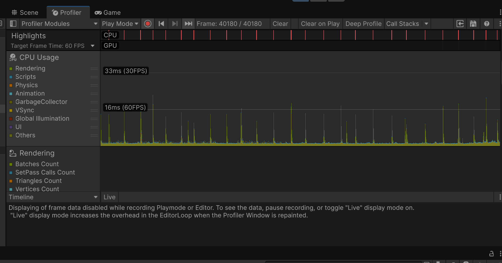
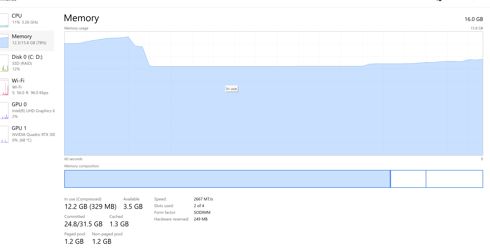

<p align="center">
  
</p>

---
# 🌌 Infinity Horde — GPU Massive Swarm System


> **High-performance GPU-driven swarm simulation capable of rendering and simulating 10M+ entities in real-time with a single Draw Call.**
## 🎬 Demo Video

<p align="center">
  <a href="https://youtu.be/TGVWkJIgo4I">
    
  </a>
</p>

<p align="center">
  <em>Click the image above to watch the technical demonstration on YouTube.</em>
</p>

---

## 📊 Performance Analytics

### 🛠 Unity Profiler (CPU/GPU)


### 🖥 System Task Manager


### Performance Benchmarks *(RTX 3060 / Ryzen 5)*

| Entity Count | FPS | CPU Usage | Draw Calls |
|-------------|-----|-----------|------------|
| 100K        | 200+ | ~1%      | 1 |
| 1M          | 150+ | ~2%      | 1 |
| 10M         | 90+  | ~3%      | 1 |
| 50M+        | 60+ *(VRAM Limit)* | ~3% | 1 |

---

## 🚀 Overview

### 🇺🇸 English
**Infinity Horde** is a GPU-driven swarm simulation system built to bypass traditional CPU bottlenecks in large-scale entity processing.  
Instead of relying on conventional C# update loops, the simulation logic is moved entirely to **Compute Shaders**, while rendering is handled using **Indirect Instancing**.

This allows the project to simulate and render **millions to tens of millions of active entities in real-time**, with extremely low CPU overhead.

### 🇻🇳 Tiếng Việt
**Infinity Horde** là hệ thống mô phỏng bầy đàn chạy hoàn toàn trên **GPU**, được thiết kế để phá vỡ giới hạn hiệu năng của CPU trong các bài toán số lượng thực thể cực lớn.  
Thay vì xử lý bằng các vòng lặp C# truyền thống, toàn bộ logic mô phỏng được đưa sang **Compute Shader**, còn phần hiển thị sử dụng **Indirect Instancing**.

Kết quả là hệ thống có thể mô phỏng và render **hàng triệu đến hàng chục triệu thực thể theo thời gian thực**, với mức tải CPU gần như không đáng kể.

---

## ⚡ Core Technical Features

- **Massive Scale**  
  Supports from **1M → 100M+ entities**, limited primarily by available **VRAM**.

- **GPU Simulation**  
  Movement, velocity, and steering are computed fully in parallel via **HLSL Compute Shaders**.

- **Single Draw Call Rendering**  
  The entire horde is rendered using **`Graphics.RenderMeshIndirect`** in just **one draw call**.

- **Infinite Persistence**  
  Entities remain active indefinitely and do not automatically despawn when off-screen.

- **Multi-Portal Spawning**  
  Supports multiple spawn points with custom spawning logic.

- **Ground-Lock Physics**  
  Entities are constrained to a terrain/2D plane using lightweight shader-based calculations.

---

## 💰 Integrated Monetization & Interaction (Google AdMob)

This project also demonstrates a **professional Google Mobile Ads (AdMob) integration**, showing how a highly technical real-time simulation can still support monetization and interactive UX features.

### 🕹 Interactive Rewards

- **Rewarded Color Shift**  
  Users can watch a **Rewarded Video Ad** to unlock a brand-new color palette for the entire **10M+ entity horde**.

- **Instant GPU Feedback**  
  The color update happens instantly through **material property changes on the GPU**, without reloading or reinitializing the simulation.

### 📱 Dynamic Ad Controls (Runtime Adjuster)

A built-in **AdsAdjuster** system allows developers to test ad layouts in real time:

- **Toggle Position** — switch between **Top** and **Bottom**
- **Toggle Size** — switch between **Standard Banner** and **Medium Rectangle (300×250)**
- **Clean Mode** — instantly destroy/close ads for clean gameplay recording or presentation

---

## 🧠 Technical Architecture

### 1. C# Manager
Responsible for:

- Initializing GPU buffers
- Dispatching Compute Shader kernels
- Passing runtime parameters to shaders
- Managing indirect draw arguments

### 2. Compute Shader
Handles movement simulation for **N entities** in parallel.

Core update logic concept:

```hlsl
Velocity = lerp(CurrentVel, TargetDir * Speed, DeltaTime);
🔥 Why This Project Matters

Infinity Horde is more than just a rendering test.
It is a technical demonstration of modern GPU-first architecture in Unity, proving that massive real-time simulations can be achieved without relying on CPU-heavy object management.

This project is especially valuable for:

large-scale swarm systems
crowd simulations
bullet hell / horde gameplay
RTS unit rendering
AI population visualization
high-performance technical demos
👨‍💻 Author & Contact

Quách Thành Long
Game Developer • System Architect • AI Engineer

🌐 Portfolio: quachthanhlong.com
📧 Email: stephensouth1307@gmail.com
🏫 Institution: VTC Academy — Game Development Department
📜 License

This project is licensed under the MIT License.
Feel free to use, modify, and adapt it for your own massive swarm simulations and GPU-driven experiments.

🏷 Tags

#Unity3D #Gamedev #ComputeShader #GPUComputing #HighPerformance #GoogleAdMob #VTC_Academy